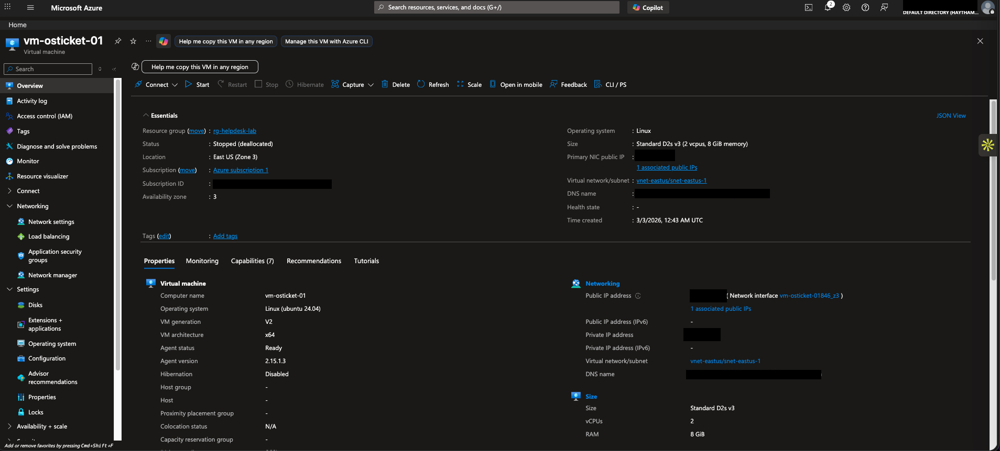
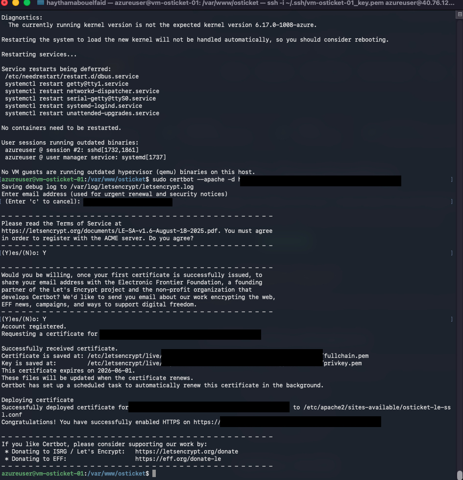
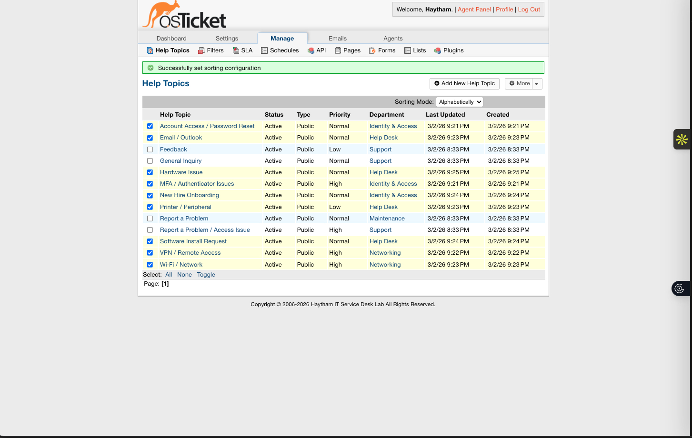
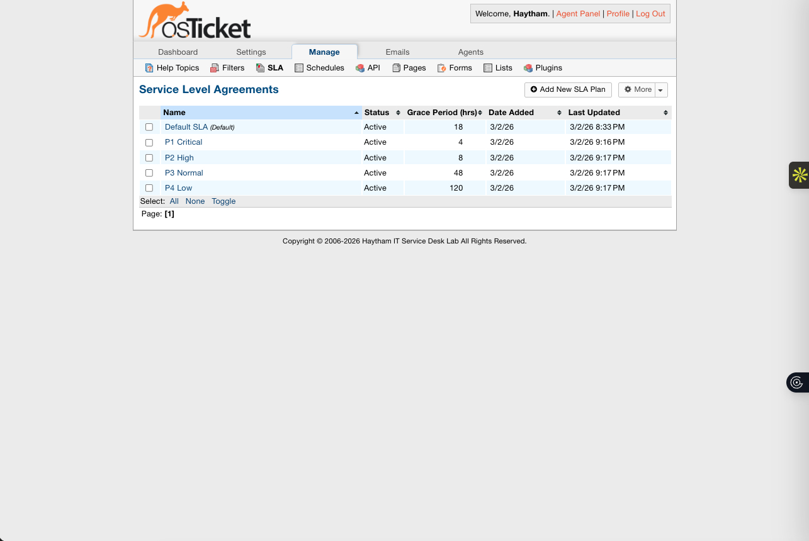
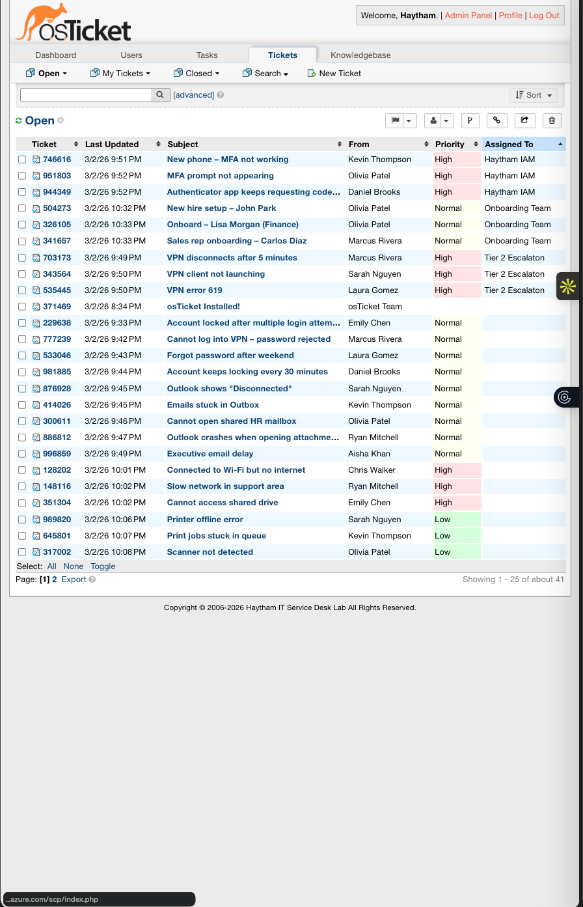
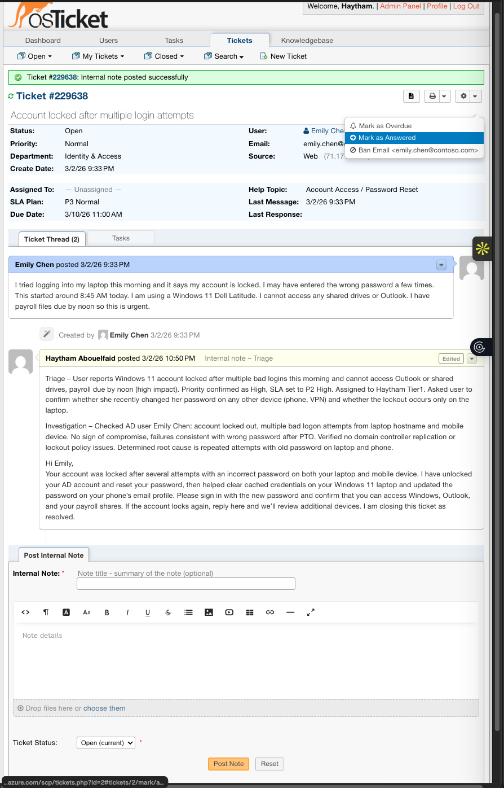
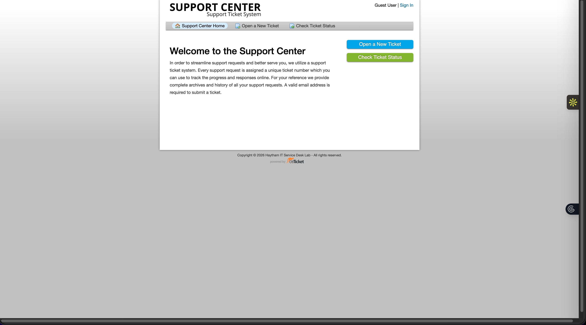

# Enterprise Help Desk Simulation (osTicket) — Azure Cloud Deployment

A production-style help desk lab simulating enterprise IT operations using **osTicket** hosted on **Microsoft Azure** (Ubuntu + Apache + MySQL), secured with **HTTPS (Let’s Encrypt/Certbot)**, configured with **departments, help topics, RBAC, and SLA tiers (P1–P4)**, and validated through a **40-ticket enterprise simulation** with metrics reporting.

## Highlights
- Deployed osTicket on **Azure Ubuntu VM** with **Apache + MySQL**
- Implemented **HTTPS (Let’s Encrypt via Certbot)** for secure web access
- Designed **department-based routing** (Help Desk, Networking, Identity & Access)
- Configured **role-based access control (RBAC)** and operational workflows
- Implemented **SLA tiers (P1–P4)** with response and resolution targets
- Simulated **40+ tickets** across VPN, MFA, Outlook, onboarding, hardware, and network issues
- Built a **metrics dashboard** tracking volume, priority distribution, SLA performance, and recurring trends

## Tech Stack
- **Cloud:** Microsoft Azure (Linux VM, NSG)
- **OS:** Ubuntu Server
- **Web:** Apache
- **DB:** MySQL
- **Ticketing:** osTicket
- **TLS:** Certbot / Let’s Encrypt
- **Documentation:** SOPs, Runbooks, Knowledge Base
- **Reporting:** Metrics dashboard (Google Sheets export)

## Screenshots (Project Walkthrough)
1. Azure Hosting Proof  
   

2. HTTPS / Certbot Hardening  
   

3. Department Routing Design  
   

4. SLA Tier Configuration  
   

5. Ticket Volume + Priorities  
   

6. Full Ticket Lifecycle Example  
   

7. End User Support Portal  
   

## Documentation
- **SOP + SLA Policy:** `docs/Help-Desk-SOP-and-SLA-Policy.pdf`
- **Troubleshooting Runbooks:** `docs/Troubleshooting-Runbooks.pdf`
- **Knowledge Base Articles:** `docs/Knowledge-Base-Articles.pdf`
- **Metrics Dashboard:** `docs/Help-Desk-Metrics-Dashboard.pdf` (or `.xlsx`)

## What I Learned / Demonstrated
- Cloud VM provisioning and secure administration (SSH key auth)
- Web app deployment and TLS enablement
- IT service management concepts: triage, escalation, SLAs, documentation
- Operational reporting and trend analysis for continuous improvement

## Notes
This repository contains **sanitized** documentation and screenshots. Sensitive values (IPs, DNS labels, admin usernames) are redacted.
